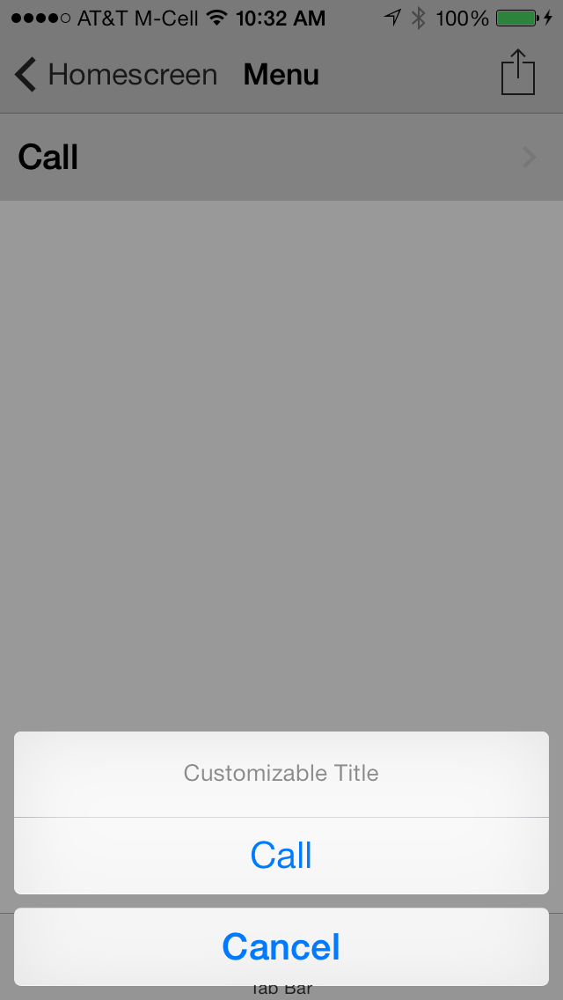

# Phone Dialer Plugin for the Buzztouch Platform

## About Plugin
### Description
The Phone Dialer plugin allows the developer to customize how the native phone application is launched. Either an AlertView Action Sheet is presented prompting the user to place the phone call. After the phone call, the developer can configure the device to return to their app, or to the phone app. For best results, use the "fade" transition when loading this plugin.

### Version History
v1.0-Initial Release of Plugin

v1.1-Compatibility with BT4.0 and iOS 10

### iOS Project
JC_PhoneDialer.h

JC_PhoneDialer.m

### Android Project
This plugin is not compatible with Android.

### JSON Data
`{
 "itemId": "11223344",
 "itemType": "JC_PhoneDialer",
 "itemNickname": "Place Call",
 "callType": "advanced",
 "alertOrActionSheet": "alert",
 "promptTitle": "Title",
 "promptMessage": "Message",
 "callButtonTitle": "Call",
 "cancelButtonTitle": "Cancel"
}`

## Screenshots

## Installation
If a previous version of this plugin is installed on your server that was downloaded from the Buzztouch Plugin Market, we reccomend that you delete this plugin's folder under /filed/plugins/ and then upload the new package and refresh your plugin list.

## Questions and Answers
Can I use this plugin on my self-hosted Buzztouch account?

*Yes, you can download the plugin from this repository as a zip file, and upload it to your Buzztouch self-hosted Control Panel*

Can I use this plugin on apps hosted at Buzztouch.com?

*Yes, but you must install it through the [Buzztouch Plugin Market](http://www.buzztouch.com/plugins/plugin.php?pid=36034D9ADE974ED4CE7EBE9).*

## Collaboration
To become a collaborator with this project, please contact us on either our [Twitter](http://twitter.com/jakechasan) or our [Facebook](http://facebook.com/jakechasanapps) pages.

## Support
For support and further questions, please contact us on either our [Twitter](http://twitter.com/jakechasan) or our [Facebook](http://facebook.com/jakechasanapps) pages.

Support is also availible from other Buzztouch users on the [Buzztouch Forums](http://www.buzztouch.com/forum/).